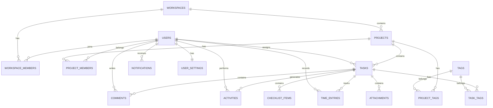

# Database Design

Version: 1.0

---

# 1. Overview

本ドキュメントは、Task Managerにおけるデータベース構造を定義する。

本システムではCloudflare D1をデータベースとして使用し、SQLite互換のデータモデルを採用する。

ORMにはDrizzle ORMを採用予定とする。

---

# 2. Database Stack

| Technology    | Purpose                         |
| ------------- | ------------------------------- |
| Cloudflare D1 | Database                        |
| SQLite        | Database Engine                 |
| Drizzle ORM   | ORM / Type-safe Database Access |

---

# 3. Design Principles

以下をデータベース設計の基本方針とする。

- 型安全なデータアクセス
- 正規化を基本とする
- 不要なデータ重複を避ける
- Foreign Keyを明示する
- 適切なIndexを設定する
- ユーザーごとのデータを適切に分離する
- Project / Task単位の権限管理に対応する
- Analyticsを効率的に取得できる構造にする
- 将来的なWorkspace機能に対応する
- SQLite / D1の制約を考慮する

---

# 4. Entity Overview

主要Entityは以下とする。

```text
User
 │
 ├── Workspace Member
 │        │
 │        ▼
 │     Workspace
 │        │
 │        ├── Project
 │        │      │
 │        │      ├── Project Member
 │        │      │
 │        │      └── Task
 │        │             │
 │        │             ├── Checklist
 │        │             ├── Comment
 │        │             ├── Attachment
 │        │             ├── Activity
 │        │             ├── Time Entry
 │        │             └── Task Tag
 │        │
 │        └── Project Tag
 │
 ├── Notification
 │
 └── User Settings
```

---

# 5. ER Diagram



---

# 6. ID Strategy

すべての主要Entityでは、アプリケーション側で生成した一意な文字列IDを使用する。

例

```text
user_01J...
workspace_01J...
project_01J...
task_01J...
```

IDはClientから推測可能な連番を使用しない。

候補としてULIDまたはUUID系のID生成方式を採用する。

---

# 7. Timestamp Strategy

日時はUTCを基本とする。

DatabaseではUnix Timestampを基本とする。

例

```text
created_at
updated_at
deleted_at
```

アプリケーション側でDate型へ変換する。

ユーザーへの表示時には、ユーザー設定のTimezoneを使用する。

---

# 8. Users

ユーザー情報を管理する。

## Table

```text
users
```

## Columns

| Column         | Type    | Nullable | Description                  |
| -------------- | ------- | -------: | ---------------------------- |
| id             | TEXT    |       No | User ID                      |
| name           | TEXT    |      Yes | Display Name                 |
| username       | TEXT    |      Yes | Username                     |
| email          | TEXT    |       No | Email                        |
| email_verified | INTEGER |      Yes | Email verification timestamp |
| image          | TEXT    |      Yes | Avatar URL                   |
| job_title      | TEXT    |      Yes | Job Title                    |
| bio            | TEXT    |      Yes | Profile description          |
| website        | TEXT    |      Yes | Website URL                  |
| role           | TEXT    |       No | System role                  |
| timezone       | TEXT    |       No | Timezone                     |
| language       | TEXT    |       No | Language                     |
| created_at     | INTEGER |       No | Created timestamp            |
| updated_at     | INTEGER |       No | Updated timestamp            |

---

# 9. User Constraints

## Email

一意であること。

```text
UNIQUE(email)
```

## Username

設定されている場合、一意であること。

```text
UNIQUE(username)
```

---

# 10. Authentication Tables

Auth.jsを利用する場合、Auth.js / Drizzle Adapterの仕様に合わせて認証関連テーブルを用意する。

対象

```text
accounts
sessions
verification_tokens
```

認証関連テーブルの正確なSchemaは、採用するAuth.js Adapterの仕様を確認してから確定する。

アプリケーション独自のUser Profile情報と認証情報を同一テーブルに過剰に詰め込まない。

---

# 11. Workspaces

将来的なチーム利用を考慮し、Workspaceを定義する。

## Table

```text
workspaces
```

## Columns

| Column      | Type    | Nullable | Description       |
| ----------- | ------- | -------: | ----------------- |
| id          | TEXT    |       No | Workspace ID      |
| name        | TEXT    |       No | Workspace Name    |
| slug        | TEXT    |       No | URL Identifier    |
| description | TEXT    |      Yes | Description       |
| created_by  | TEXT    |       No | Creator User ID   |
| created_at  | INTEGER |       No | Created timestamp |
| updated_at  | INTEGER |       No | Updated timestamp |

---

# 12. Workspace Members

WorkspaceとUserの多対多関係を管理する。

## Table

```text
workspace_members
```

## Columns

| Column       | Type    | Nullable | Description             |
| ------------ | ------- | -------: | ----------------------- |
| id           | TEXT    |       No | Membership ID           |
| workspace_id | TEXT    |       No | Workspace ID            |
| user_id      | TEXT    |       No | User ID                 |
| role         | TEXT    |       No | owner / member / viewer |
| created_at   | INTEGER |       No | Created timestamp       |
| updated_at   | INTEGER |       No | Updated timestamp       |

---

# 13. Workspace Member Constraints

同じUserが同じWorkspaceに複数登録されないようにする。

```text
UNIQUE(workspace_id, user_id)
```

---

# 14. Projects

プロジェクト情報を管理する。

## Table

```text
projects
```

## Columns

| Column       | Type    | Nullable | Description          |
| ------------ | ------- | -------: | -------------------- |
| id           | TEXT    |       No | Project ID           |
| workspace_id | TEXT    |       No | Workspace ID         |
| name         | TEXT    |       No | Project Name         |
| description  | TEXT    |      Yes | Description          |
| color        | TEXT    |       No | Project Accent Color |
| status       | TEXT    |       No | Project Status       |
| priority     | TEXT    |       No | Project Priority     |
| start_date   | INTEGER |      Yes | Start Date           |
| deadline     | INTEGER |      Yes | Deadline             |
| created_by   | TEXT    |       No | Creator User ID      |
| created_at   | INTEGER |       No | Created timestamp    |
| updated_at   | INTEGER |       No | Updated timestamp    |
| archived_at  | INTEGER |      Yes | Archived timestamp   |

---

# 15. Project Status

許可する値

```text
planning
active
on_hold
completed
archived
```

---

# 16. Project Priority

許可する値

```text
low
medium
high
```

---

# 17. Project Progress

ProjectのProgressは原則としてDatabaseへ直接保存しない。

TaskのStatusから算出する。

```text
Progress =
Completed Tasks / Total Tasks × 100
```

例

```text
Total Tasks: 50
Completed: 35

Progress: 70%
```

これにより、Taskの状態とProject Progressの不整合を防止する。

---

# 18. Project Members

ProjectとUserの多対多関係を管理する。

## Table

```text
project_members
```

## Columns

| Column     | Type    | Nullable | Description             |
| ---------- | ------- | -------: | ----------------------- |
| id         | TEXT    |       No | Membership ID           |
| project_id | TEXT    |       No | Project ID              |
| user_id    | TEXT    |       No | User ID                 |
| role       | TEXT    |       No | owner / member / viewer |
| created_at | INTEGER |       No | Created timestamp       |

---

# 19. Project Member Constraints

```text
UNIQUE(project_id, user_id)
```

Project Memberは、原則としてWorkspace Memberである必要がある。

---

# 20. Tasks

タスク情報を管理する。

## Table

```text
tasks
```

## Columns

| Column       | Type    | Nullable | Description          |
| ------------ | ------- | -------: | -------------------- |
| id           | TEXT    |       No | Task ID              |
| project_id   | TEXT    |       No | Project ID           |
| title        | TEXT    |       No | Task Title           |
| description  | TEXT    |      Yes | Description          |
| status       | TEXT    |       No | Task Status          |
| priority     | TEXT    |       No | Priority             |
| assignee_id  | TEXT    |      Yes | Assigned User        |
| reporter_id  | TEXT    |      Yes | Reporter             |
| start_date   | INTEGER |      Yes | Start Date           |
| due_date     | INTEGER |      Yes | Due Date             |
| position     | REAL    |       No | Kanban Position      |
| created_at   | INTEGER |       No | Created timestamp    |
| updated_at   | INTEGER |       No | Updated timestamp    |
| completed_at | INTEGER |      Yes | Completion timestamp |
| archived_at  | INTEGER |      Yes | Archived timestamp   |

---

# 21. Task Status

許可する値

```text
backlog
todo
in_progress
review
done
```

Task Boardでは以下の順番で表示する。

```text
Backlog
Todo
In Progress
Review
Done
```

---

# 22. Task Priority

許可する値

```text
low
medium
high
```

---

# 23. Task Position

Kanban Boardの並び順を管理する。

```text
position
```

は整数ではなくREALを使用可能とする。

例

```text
1
2
3
```

Taskを2と3の間に挿入する場合

```text
2.5
```

とする。

これにより、Task移動のたびに同一Column内の全Taskを更新する必要を減らす。

大量の移動によりPositionの値が細かくなった場合は、Position Rebalancingを実行する。

---

# 24. Checklist Items

Task内のチェックリストを管理する。

## Table

```text
checklist_items
```

## Columns

| Column     | Type    | Nullable | Description       |
| ---------- | ------- | -------: | ----------------- |
| id         | TEXT    |       No | Checklist ID      |
| task_id    | TEXT    |       No | Task ID           |
| title      | TEXT    |       No | Item Title        |
| completed  | INTEGER |       No | Completion Flag   |
| position   | REAL    |       No | Display Order     |
| created_at | INTEGER |       No | Created timestamp |
| updated_at | INTEGER |       No | Updated timestamp |

---

# 25. Tags

ProjectおよびTaskで利用するタグを管理する。

## Table

```text
tags
```

## Columns

| Column       | Type    | Nullable | Description       |
| ------------ | ------- | -------: | ----------------- |
| id           | TEXT    |       No | Tag ID            |
| workspace_id | TEXT    |       No | Workspace ID      |
| name         | TEXT    |       No | Tag Name          |
| color        | TEXT    |       No | Tag Color         |
| created_at   | INTEGER |       No | Created timestamp |

---

# 26. Project Tags

ProjectとTagの多対多関係。

## Table

```text
project_tags
```

## Columns

| Column     | Type | Nullable | Description |
| ---------- | ---- | -------: | ----------- |
| project_id | TEXT |       No | Project ID  |
| tag_id     | TEXT |       No | Tag ID      |

Constraint

```text
PRIMARY KEY(project_id, tag_id)
```

---

# 27. Task Tags

TaskとTagの多対多関係。

## Table

```text
task_tags
```

## Columns

| Column  | Type | Nullable | Description |
| ------- | ---- | -------: | ----------- |
| task_id | TEXT |       No | Task ID     |
| tag_id  | TEXT |       No | Tag ID      |

Constraint

```text
PRIMARY KEY(task_id, tag_id)
```

---

# 28. Comments

Taskへのコメントを管理する。

## Table

```text
comments
```

## Columns

| Column     | Type    | Nullable | Description           |
| ---------- | ------- | -------: | --------------------- |
| id         | TEXT    |       No | Comment ID            |
| task_id    | TEXT    |       No | Task ID               |
| author_id  | TEXT    |       No | Author User ID        |
| content    | TEXT    |       No | Comment               |
| created_at | INTEGER |       No | Created timestamp     |
| updated_at | INTEGER |       No | Updated timestamp     |
| deleted_at | INTEGER |      Yes | Soft Delete timestamp |

---

# 29. Attachments

Taskに添付されたファイルのMetadataを管理する。

## Table

```text
attachments
```

## Columns

| Column      | Type    | Nullable | Description        |
| ----------- | ------- | -------: | ------------------ |
| id          | TEXT    |       No | Attachment ID      |
| task_id     | TEXT    |       No | Task ID            |
| uploaded_by | TEXT    |       No | User ID            |
| file_name   | TEXT    |       No | Original File Name |
| file_size   | INTEGER |       No | File Size          |
| mime_type   | TEXT    |       No | MIME Type          |
| storage_key | TEXT    |       No | Storage Object Key |
| created_at  | INTEGER |       No | Created timestamp  |

ファイル本体はD1へ保存しない。

将来的にはCloudflare R2などのObject Storageへ保存する。

D1にはMetadataのみ保存する。

---

# 30. Activities

ユーザー操作履歴を管理する。

## Table

```text
activities
```

## Columns

| Column       | Type    | Nullable | Description       |
| ------------ | ------- | -------: | ----------------- |
| id           | TEXT    |       No | Activity ID       |
| workspace_id | TEXT    |       No | Workspace ID      |
| project_id   | TEXT    |      Yes | Project ID        |
| task_id      | TEXT    |      Yes | Task ID           |
| user_id      | TEXT    |       No | Actor User ID     |
| action       | TEXT    |       No | Action Type       |
| metadata     | TEXT    |      Yes | JSON Metadata     |
| created_at   | INTEGER |       No | Created timestamp |

---

# 31. Activity Actions

例

```text
project_created
project_updated
project_archived

task_created
task_updated
task_status_changed
task_assignee_changed
task_completed
task_archived

comment_created
comment_updated
comment_deleted

checklist_created
checklist_completed

member_added
member_removed
```

---

# 32. Activity Metadata

MetadataはJSON文字列として保存する。

例

```json
{
  "from": "todo",
  "to": "in_progress"
}
```

Activity本文をDatabaseに保存するのではなく、ActionとMetadataから表示内容を生成する。

---

# 33. Notifications

アプリ内通知を管理する。

## Table

```text
notifications
```

## Columns

| Column      | Type    | Nullable | Description        |
| ----------- | ------- | -------: | ------------------ |
| id          | TEXT    |       No | Notification ID    |
| user_id     | TEXT    |       No | Recipient User ID  |
| type        | TEXT    |       No | Notification Type  |
| title       | TEXT    |       No | Notification Title |
| body        | TEXT    |      Yes | Notification Body  |
| entity_type | TEXT    |      Yes | Related Entity     |
| entity_id   | TEXT    |      Yes | Related Entity ID  |
| read_at     | INTEGER |      Yes | Read timestamp     |
| created_at  | INTEGER |       No | Created timestamp  |

---

# 34. User Settings

ユーザー個人の設定を管理する。

## Table

```text
user_settings
```

## Columns

| Column                 | Type    | Nullable | Description          |
| ---------------------- | ------- | -------: | -------------------- |
| user_id                | TEXT    |       No | User ID              |
| theme                  | TEXT    |       No | Theme                |
| accent_color           | TEXT    |       No | Accent Color         |
| density                | TEXT    |       No | UI Density           |
| animations             | INTEGER |       No | Animation Enabled    |
| email_notifications    | INTEGER |       No | Email Notification   |
| in_app_notifications   | INTEGER |       No | In-app Notification  |
| task_notifications     | INTEGER |       No | Task Notification    |
| mention_notifications  | INTEGER |       No | Mention Notification |
| due_soon_notifications | INTEGER |       No | Due Notification     |
| created_at             | INTEGER |       No | Created timestamp    |
| updated_at             | INTEGER |       No | Updated timestamp    |

---

# 35. User Settings Constraints

Userごとに1レコードのみ。

```text
PRIMARY KEY(user_id)
```

---

# 36. Time Entries

Analyticsで作業時間を表示するための将来拡張テーブル。

## Table

```text
time_entries
```

## Columns

| Column           | Type    | Nullable | Description       |
| ---------------- | ------- | -------: | ----------------- |
| id               | TEXT    |       No | Time Entry ID     |
| task_id          | TEXT    |       No | Task ID           |
| user_id          | TEXT    |       No | User ID           |
| started_at       | INTEGER |       No | Start timestamp   |
| ended_at         | INTEGER |      Yes | End timestamp     |
| duration_seconds | INTEGER |      Yes | Duration          |
| created_at       | INTEGER |       No | Created timestamp |

---

# 37. Time Entry Rules

作業時間は以下で算出する。

```text
duration =
ended_at - started_at
```

タイマーが実行中の場合は `ended_at` をNULLとする。

同一Userによる複数の同時タイマーは原則として禁止する。

---

# 38. Analytics Data

Analytics専用の集計テーブルは初期実装では作成しない。

以下のデータから算出する。

```text
Tasks
Activities
Time Entries
Projects
Project Members
```

例

## Completion Rate

```text
Completed Tasks
÷
Total Tasks
× 100
```

---

## Average Completion Time

```text
completed_at - created_at
```

を完了Taskについて平均する。

---

## Overdue Tasks

以下を満たすTask。

```text
due_date < current_time
AND
status != done
```

---

# 39. Foreign Keys

主要なRelationshipにはForeign Keyを設定する。

例

```text
projects.workspace_id
    → workspaces.id

tasks.project_id
    → projects.id

tasks.assignee_id
    → users.id

comments.task_id
    → tasks.id

comments.author_id
    → users.id
```

---

# 40. Delete Strategy

原則として、関連データの削除方式をEntityごとに定義する。

## Project

通常はArchiveを優先する。

```text
archived_at
```

を設定する。

---

## Task

通常はArchiveを優先する。

---

## Comment

Soft Deleteを使用する。

```text
deleted_at
```

---

## Membership

Membershipレコード自体を削除する。

---

# 41. Cascade Rules

Project削除などの破壊的操作では、関連データの扱いを明示する。

例

```text
Project
 ├── Tasks
 │    ├── Checklist
 │    ├── Comments
 │    ├── Attachments
 │    └── Activities
 │
 └── Project Members
```

Projectを完全削除する処理は通常のUIから提供せず、原則としてArchiveを使用する。

完全削除が必要になった場合はTransaction内で関連データを処理する。

---

# 42. Index Strategy

検索・一覧表示・JOINで使用するカラムにIndexを設定する。

## Users

```text
users.email
users.username
```

---

## Workspaces

```text
workspaces.slug
workspaces.created_by
```

---

## Workspace Members

```text
workspace_members.workspace_id
workspace_members.user_id
```

---

## Projects

```text
projects.workspace_id
projects.status
projects.deadline
projects.updated_at
```

---

## Project Members

```text
project_members.project_id
project_members.user_id
```

---

## Tasks

```text
tasks.project_id
tasks.status
tasks.assignee_id
tasks.due_date
tasks.updated_at
tasks.position
```

---

## Comments

```text
comments.task_id
comments.author_id
comments.created_at
```

---

## Activities

```text
activities.workspace_id
activities.project_id
activities.task_id
activities.user_id
activities.created_at
```

---

## Notifications

```text
notifications.user_id
notifications.read_at
notifications.created_at
```

---

# 43. Search Strategy

Project Listでは以下を検索対象とする。

```text
projects.name
projects.description
```

Task Boardでは以下を検索対象とする。

```text
tasks.title
tasks.description
```

初期実装ではSQLiteのLIKE検索を使用する。

データ量が増加した場合はSQLite FTS5などを検討する。

---

# 44. Pagination Strategy

大量データを取得する場合はPaginationを使用する。

基本値

```text
limit = 20
```

最大値

```text
limit = 100
```

Project List、Task List、Activity、Commentsなどで使用する。

---

# 45. Transaction Strategy

複数Entityを同時に変更する処理ではTransactionを使用する。

例

## Task Status Change

```text
Task Status Update
        │
        ├── Update Task
        │
        └── Create Activity
```

この2つを同一Transactionとして扱う。

---

# 46. Task Move Transaction

KanbanでTaskを移動する場合、

```text
Task Position Update
        │
        └── Activity Create
```

を一貫した処理として扱う。

APIが成功したにもかかわらずActivityだけ作成されない状態を防止する。

---

# 47. Data Integrity

以下の不整合を許可しない。

- 存在しないProjectへのTask
- 存在しないUserのProject Membership
- 存在しないTaskへのComment
- 存在しないTaskへのChecklist
- Projectに所属していないUserをProject Memberとして登録
- Projectに所属していないUserをTask Assigneeに設定

---

# 48. Authorization Data Model

Authorizationは以下のRelationshipから判断する。

```text
User
 ↓
Workspace Membership
 ↓
Workspace
 ↓
Project Membership
 ↓
Project
 ↓
Task
```

Taskへのアクセス権限は、原則として所属ProjectおよびWorkspaceから判断する。

---

# 49. Multi-Tenant Isolation

Workspaceをテナント境界として扱う。

すべてのWorkspace関連データは、ユーザーが所属しているWorkspaceを経由してアクセスする。

```text
Request
 ↓
Authenticated User
 ↓
Workspace Membership
 ↓
Workspace ID
 ↓
Resource
```

ユーザーが所属していないWorkspaceのデータを取得してはいけない。

---

# 50. Security Rules

Databaseアクセスでは以下を必須とする。

- Authentication Check
- Authorization Check
- Foreign Key Validation
- Input Validation
- Parameterized Query
- SQL Injection Protection

Clientから送信された `workspaceId` や `userId` をそのまま信用しない。

必ずSession情報およびMembershipから権限を確認する。

---

# 51. Database Migration

Database Schema変更はMigrationで管理する。

Migrationを直接Production Databaseへ手動適用することを避ける。

想定構成

```text
drizzle/
├── migrations/
└── meta/
```

---

# 52. Seed Data

開発環境ではSeed Dataを利用できるようにする。

Seedには以下を含める。

- Demo User
- Demo Workspace
- Demo Projects
- Demo Tasks
- Demo Members
- Demo Comments
- Demo Activities
- Demo Notifications

---

# 53. Demo Data Requirements

Portfolio用のDemo Dataは、実際のアプリケーションが動作しているように見える量を用意する。

例

```text
Projects: 8〜12
Tasks: 50〜100
Members: 5〜10
Comments: 30〜50
Activities: 100+
```

ただし、本番環境へ開発用Demo Dataを投入しない。

---

# 54. Backup

Cloudflare D1のバックアップ・復旧仕様を確認し、Production運用時には適切なバックアップ戦略を採用する。

Portfolioの初期段階では、Databaseバックアップを別途設計する必要性が発生した時点で検討する。

---

# 55. Database Performance

以下を避ける。

- 全件SELECT
- 不要なJOIN
- N+1 Query
- 大量データのClient転送
- 不要なCOUNT
- 不要なSELECT \*

必要なカラムのみ取得する。

---

# 56. N+1 Prevention

例えばProject ListでMembersを取得する場合、

```text
Projects
 ↓
ProjectごとにMembers Query
```

のようなN+1 Queryを避ける。

必要に応じてJOINまたはBatch Queryを利用する。

---

# 57. Data Access Rules

UI ComponentからDatabaseへ直接アクセスしてはいけない。

禁止

```text
Client Component
   ↓
D1
```

推奨

```text
Client Component
   ↓
API / Server Action
   ↓
Service
   ↓
Repository
   ↓
Drizzle
   ↓
D1
```

---

# 58. Drizzle Schema

DrizzleのSchemaは以下のようにFeatureまたはDatabase領域で管理する。

候補

```text
lib/db/
├── index.ts
├── schema/
│   ├── users.ts
│   ├── workspaces.ts
│   ├── projects.ts
│   ├── tasks.ts
│   ├── comments.ts
│   ├── activities.ts
│   ├── notifications.ts
│   └── settings.ts
└── migrations/
```

実装時にプロジェクトの既存Directory Structureと整合させる。

---

# 59. Type Safety

Database SchemaからTypeScriptの型を推論する。

Application内でDatabase Entityの型を重複定義しない。

可能な限りDrizzle SchemaからTypeScript Typeを生成・推論する。

---

# 60. Validation

Database Schemaだけに入力値検証を依存しない。

以下の2段階で検証する。

```text
Request
 ↓
Zod
 ↓
Service
 ↓
Drizzle
 ↓
D1
```

---

# 61. API Relationship

DatabaseとAPIの主要なRelationshipは以下。

```text
GET /projects
    ↓
projects

GET /projects/:projectId
    ↓
projects
    ├── project_members
    ├── tasks
    └── activities

GET /projects/:projectId/tasks
    ↓
tasks

GET /tasks/:taskId
    ↓
tasks
    ├── checklist_items
    ├── comments
    ├── attachments
    ├── activities
    └── time_entries
```

---

# 62. Screen Relationship

| Screen         | Main Tables                                                   |
| -------------- | ------------------------------------------------------------- |
| Login          | users / accounts / sessions                                   |
| Dashboard      | projects / tasks / activities / notifications                 |
| Project List   | projects / project_members / tasks                            |
| Project Detail | projects / project_members / tasks / activities               |
| Task Board     | tasks / users / task_tags                                     |
| Task Detail    | tasks / checklist_items / comments / attachments / activities |
| Calendar       | tasks / projects                                              |
| Analytics      | tasks / projects / activities / time_entries                  |
| Settings       | users / user_settings                                         |
| Profile        | users / projects / tasks / activities                         |

---

# 63. Analytics Query Principles

Analyticsでは可能な限り既存データから算出する。

専用のAnalytics Tableを初期実装では作らない。

理由

- Schemaを単純に保てる
- データの二重管理を避けられる
- Task変更時の集計更新が不要
- Portfolio規模では十分な性能が期待できる

データ量が増加し、Query Performanceが問題になった場合に集計テーブルを導入する。

---

# 64. Future Extensions

将来的に以下のTableを追加する可能性がある。

```text
workspace_invitations
project_templates
task_dependencies
recurring_tasks
webhooks
integrations
api_tokens
audit_logs
saved_views
custom_fields
```

---

# 65. Initial Implementation Scope

初期実装では以下を優先する。

```text
users
workspaces
workspace_members

projects
project_members

tasks
checklist_items

tags
project_tags
task_tags

comments
activities

notifications
user_settings
```

以下は必要になった段階で追加する。

```text
attachments
time_entries
integrations
webhooks
audit_logs
```

---

# 66. Implementation Rules

CursorがDatabaseを実装する場合、以下を必ず守る。

1. 本ドキュメントを参照する。
2. 既存Schemaを勝手に変更しない。
3. Schema変更時は本ドキュメントを更新する。
4. Drizzle ORMを使用する。
5. DatabaseアクセスをUI Componentに記述しない。
6. Foreign Keyを適切に設定する。
7. Indexを適切に設定する。
8. Zodによる入力検証を行う。
9. AuthorizationをService Layerで確認する。
10. Transactionが必要な処理ではTransactionを使用する。
11. N+1 Queryを避ける。
12. `SELECT *` を原則として使用しない。
13. Migrationを作成する。
14. Seed Dataを必要に応じて更新する。
15. Database関連のUnit / Integration Testを追加する。

---

# 67. Test Requirements

Database関連の変更では以下をテストする。

## Create

- User作成
- Workspace作成
- Project作成
- Task作成

## Relationship

- Workspace Member
- Project Member
- Task Assignee
- Task Tag

## Constraint

- Duplicate Membership
- Invalid Foreign Key
- Invalid Status
- Invalid Priority

## Query

- Project List
- Task List
- Task Detail
- Analytics

## Authorization

- 他Workspaceへのアクセス
- 他Projectへのアクセス
- Viewerによる編集
- Memberによる削除

テストコードはプロジェクト直下の

```text
tests/
```

へ配置する。

---

# 68. Migration Rules

Migrationを作成した場合、以下を必ず確認する。

```text
Schema
 ↓
Migration
 ↓
Local D1
 ↓
Tests
```

Migration適用後に既存データが壊れないことを確認する。

---

# 69. Current Status

現在のRepositoryでは、Database Schemaはまだ実装段階ではない。

現在の `package.json` にはDrizzle ORMおよびCloudflare D1関連パッケージはまだ導入されていない。

したがって、本ドキュメントはDatabaseの設計仕様として扱う。

実装開始時に以下を追加する。

```text
Drizzle ORM
Cloudflare D1 configuration
Database Schema
Migration
Seed
Database Tests
```

---

# 70. Final Database Principles

本プロジェクトでは以下を最重要原則とする。

> Keep the data model simple.

> Keep relationships explicit.

> Keep tenant boundaries clear.

> Keep business rules out of the database where possible.

> Keep queries efficient.

> Keep migrations reproducible.

> Keep database access type-safe.

> Never trust client-provided authorization data.
